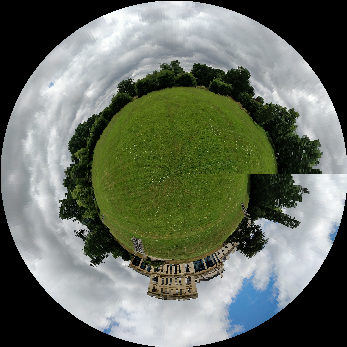
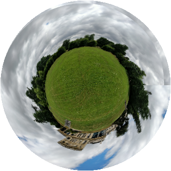
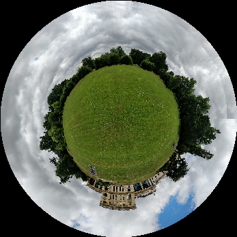

# Tinyplanet

Quick experiment in making tinyplanet images from non-ideal panoramas.

## Rationale

In order to make a good tinyplanet image, you normally need a level horizon,
otherwise your planet will have an unsightly fault:

An uneven horizon may be due to the camera not being entirely level throughout the taking of the photo, or the panorama may contain uneven ground, and not be exactly 360º.

If the height difference between the ends of the horizon is great enough, simply rotating the whole image
to fit causes extreme wonkiness in the output.

The technique used here gradually corrects the horizon alignment from the centre of the image to a mid-point between the two horizons.  This produces a better result.

## Other Resources

Uses the technique described here:

[LITTLE PLANET PHOTOS: 5 SIMPLE STEPS TO MAKING PANORAMA WORLDS](https://www.photographymad.com/pages/view/little-planet-photos-5-simple-steps-to-making-panorama-worlds)

Code for the polar distort originally from a Stack Overflow answer: [Image to polar co-ordinates](https://stackoverflow.com/a/48053026/150882)

Another command-line tinyplanet generator from [Fred's ImageMagick Scripts](http://www.fmwconcepts.com/imagemagick/tinyplanet/index.php)